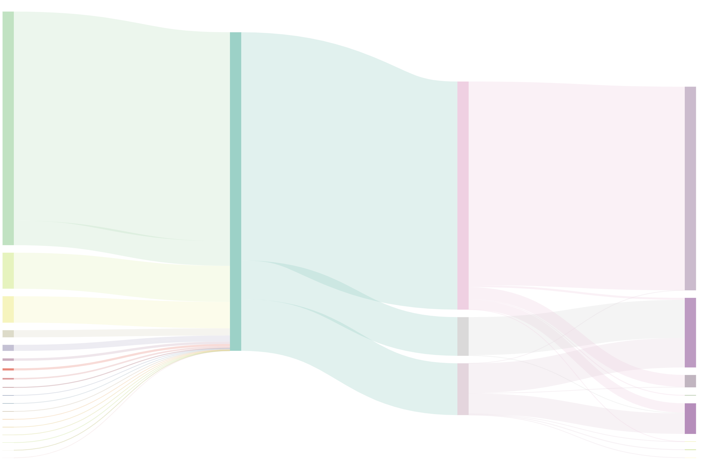

import ArticleHeader from '../../../components/Articles/ArticleHeader'

<ArticleHeader 
  title={props.pageContext.frontmatter.title || "React for data visualization"}
  description={props.pageContext.frontmatter.description}
  date={props.pageContext.frontmatter.date}
  lastUpdated={props.pageContext.frontmatter.lastUpdated} />

https://www.youtube.com/watch?v=SAmKimb8wFo

> Have you ever tried making a sankey diagram with d3+react, I can't seem to make it work for some reason.:/
>
> \~Emil

No Emil, I have not. Let's give it a shot! Thanks for finding us a dataset that fits :)

<strong>Dataset: </strong>
<a href={`./ugr-sankey-openspending.json`}>Download dataset 🗳 </a>

## My solution 👇

https://codesandbox.io/s/m9vy7mr5k8

## What is a Sankey diagram?

[Sankey diagrams](https://en.wikipedia.org/wiki/Sankey_diagram) are flow diagrams. They're often used to show flows of money and other resources between different parts of an organization. Or between different organizations. Sankey originally designed them to show energy flows in factories.

Vertical rectangles represent nodes in the flow, lines connecting the rectangles show how each node contributes to the inputs of the next node. Line thickness correlates to flow magnitude.

One of the most famous Sankey diagrams in history is this visualization of Napoleon's invasion into Russia.


No I'm not quite sure how to read that either. But it's cool and it's old ✌️

## How do you make a sankey with React and D3?

Turns out building a Sankey diagram with React and D3 isn't terribly difficult. A D3 extension library called [d3-sankey](https://github.com/d3/d3-sankey) provides a generator for them. Your job is to fill it with data, then render.

The dataset Emil found for us was specifically designed for Sankey diagrams so that was awesome. Thanks Emil. 🙏🏻

I don't know what _our_ data represents, but you gotta wrangle yours into `nodes` and `links`.

1. `nodes` are an array of representative keys, names in our case
2. `links` are an array of objects mapping a `source` inex to a `target` index with a numeric `value`

```json
{
  "nodes": [
    {
      "name": "Universidad de Granada"
    },
    {
      "name": "De Comunidades Autónomas"
    },
   //...
  ],
  "links": [
    {
      "source": 19,
      "target": 26,
      "value": 1150000
    },
    {
      "source": 0,
      "target": 19,
      "value": 283175993
    },
    //...
}
```

### Turn data into a Sankey layout

We can keep things simple with a functional component that calculates the Sankey layout on the fly with every render. We'll need some color stuff too. That was actually the hardest, lol.

```javascript
import { sankey, sankeyLinkHorizontal } from "d3-sankey";
//...

const MysteriousSankey = ({ data, width, height }) => {
  const { nodes, links } = sankey()
    .nodeWidth(15)
    .nodePadding(10)
    .extent([[1, 1], [width - 1, height - 5]])(data);
  const color = chroma.scale("Set3").classes(nodes.length);
  const colorScale = d3
    .scaleLinear()
    .domain([0, nodes.length])
    .range([0, 1]);
```

It's called `MysteriousSankey` because I don't know what our dataset represents. Takes a width, a height, and a data prop.

We get the `sankey` generator from `d3-sankey`, initialize a new generator with `sankey()`, define a width for our nodes and give them some vertical padding. Extent defines the size of our diagram with 2 coordinates: the top left and bottom right corner.

Colors are a little trickier. We use `chroma` to define a color scale based on the predefined `Set3` brewer category. We split it up into `nodes.length` worth of colors - one for each node. But this expects inputs like `0.01`, `0.1` etc.

To make that easier we define a `colorScale` as well. It takes indexes of our nodes and translates them into those 0 to 1 numbers. Feed that into the `color` thingy and it returns a color for each node.

### Render your Sankey

A good approach to render your Sankey diagram is using two components:

1. `<SankeyNode>` for each node
2. `<SankeyLink>` for each link between them

You use them in two loops in the main `<MysteriousSankey>` component.

```javascript
return (
  <g style={{ mixBlendMode: "multiply" }}>
    {nodes.map((node, i) => (
      <SankeyNode
        {...node}
        color={color(colorScale(i)).hex()}
        key={node.name}
      />
    ))}
    {links.map((link, i) => (
      <SankeyLink
        link={link}
        color={color(colorScale(link.source.index)).hex()}
      />
    ))}
  </g>
)
```

Here you can see a case of inconsistent API design. `SankeyNode` gets node data splatted into props, `SankeyLink` prefers a single prop for all the `link` info. There's a reason for that and you might want to keep to the same approach in both anyway.

Both also get a `color` prop with the messiness of translating a node index into a `[0, 1]` number passed into the chroma color scale, translated into a hex string. Mess.

### &lt;SankeyNode>

```javascript
const SankeyNode = ({ name, x0, x1, y0, y1, color }) => (
  <rect x={x0} y={y0} width={x1 - x0} height={y1 - y0} fill={color}>
    <title>{name}</title>
  </rect>
)
```

`SankeyNode`s are rectangles with a title. We take top left and bottom right coordinates from the sankey generator and feed them into rect SVG elements. Color comes form the color prop.

### &lt;SankeyLink>

```javascript
const SankeyLink = ({ link, color }) => (
  <path
    d={sankeyLinkHorizontal()(link)}
    style={{
      fill: "none",
      strokeOpacity: ".3",
      stroke: color,
      strokeWidth: Math.max(1, link.width),
    }}
  />
)
```

`SankeyLink`s are paths. We initialze a `sankeyLinkHorizontal` path generator instance, feed it `link` info and that creates the path shape for us. This is why it was easier to get everything in a single `link` prop. No idea which arguments the generator actually uses.

Styling is tricky too.

Sankey links are lines. They don't look like lines, but that's what they are. You want to make sure `fill` is set to nothing, and use `strokeWidth` to get that nice volume going.

The rest is just colors and opacities to make it look prettier.

A sankey diagram comes out 👇



You can make it betterer with some interaction on the nodes or even links. They're components so the world is your oyster. Anything you can do with components, you can do with these.
