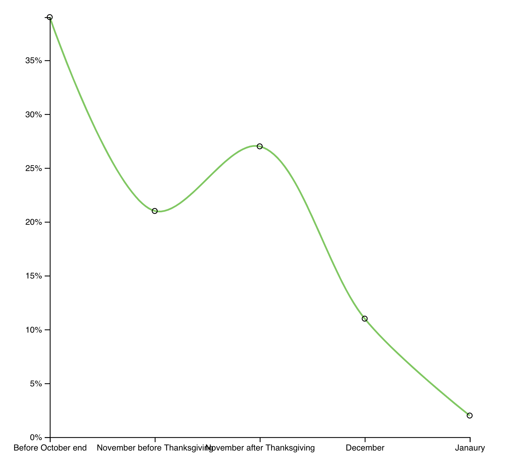

https://www.youtube.com/watch?v=VzAAGCudLe8

My girlfriend likes to buy her presents early, I wait until the last minute. What do other people do? Create a way to visualize the last few weeks of the year and rank them by popularity.

<strong>Dataset: </strong>
<a
  href={`./statistic_id246669_period-during-which-us-consumers-will-start-holiday-shopping-2018.xlsx`}
>
  Download dataset 🗳{" "}
</a>

## My solution 👇

https://codesandbox.io/s/oq730593n9

## How it works ⚙️

Well that was fun. What do you when you have a sparse dataset? A dataset with so few data points positioned so weirdly that it's almost certain to hide important trends?

You try to fix it.

With science! Math! Code!

Or ... well ... you can try. We tried a few things until we were forced to admit defeat in the face of mathematics beyond our station. Or at least beyond mine.

## Our dataset and what's wrong with it

We're visualizing results of a poll asking people _When do you start christmas shopping?_. The poll had over 4000 responses. We get just the result.

```
Before October end	39
November before Thanksgiving	21
November after Thanksgiving	27
December	11
Janaury	2
February	0
```

39% start shopping before October ends, 21% in November before thanksgiving, 27% right after thanksgiving, and so on.

You can imagine these are long timespans. Ranging from basically a whole year to just a week in length. That's a problem for us because it makes the datapoints hard to compare.

Of course Before October end is overrepresented: It's got almost four times as long to accumulate its result as the rest of the time periods combined.

## A simple presentation

We start exploring with a line chart. Borrowing a lot of code from the [Money spent on Christmas](https://reactviz.holiday/money-spent/) challenge.



That's our data plotted as a curved line. Circles represent the actual datapoints we've got. Curves are a a good first approach to show that our data might not be all that exact.

We borrow axis implementation from [Money spent on Christmas](https://reactviz.holiday/money-spent/) using my [d3blackbox](https://d3blackbox.com) library.

```javascript
const BottomAxis = d3blackbox((anchor, props) => {
  const axis = d3.axisBottom().scale(props.scale)
  d3.select(anchor.current).call(axis)
})

const LeftAxis = d3blackbox((anchor, props) => {
  const axis = d3
    .axisLeft()
    .scale(props.scale)
    .tickFormat((d) => `${d}%`)
  d3.select(anchor.current).call(axis)
})
```

Each axis implementation renders an anchor element and injects a pure D3 rendered axis on every update. No need to fiddle with building our own.

### &lt;Datapoint>

A `<Datapoints>` component keeps our main code cleaner. Renders those tiny little circles.

```javascript
const Circle = styled.circle`
  fill: none;
  stroke: black;
  r: 3px;
`

const Datapoints = ({ data, x, y }) => (
  <g>
    {data.map((d) => (
      <Circle cx={x(d.descriptor)} cy={y(d.percentage)}>
        <title>{d.descriptor}</title>
      </Circle>
    ))}
  </g>
)
```

Takes data, an `x` scale and a `y` scale. Walks through data in a loop, renders circles with a title. Makes it so you can mouse over a circle and if you do it just right a browser native tooltip appears.

### &lt;LineChart>

The LineChart component brings all of this together and uses a D3 line generator for a single path definition.

```javascript
const Line = styled.path`
  fill: none;
  stroke: ${chroma("green").brighten(1.5)};
  stroke-width: 2px;
`;

class LineChart extends React.Component {
  height = 500

  x = d3.scalePoint()
    .domain(this.props.data.map(d => d.descriptor)
    .range([0, 600]),
  y = d3
    .scaleLinear()
    .domain([0, d3.max(this.props.data, d => d.percentage)])
    .range([this.height, 0])

  line = d3
    .line()
    .x(d => this.x(d.percentage))
    .y(d => this.y(d.descriptor))
    .curve(d3.curveCatmullRom.alpha(0.5))

  render() {
    const { data, x, y } = this.props;

    return (
      <g transform={`translate(${x}, ${y})`}>
        <Line d={this.line(data)} />
        <Datapoints data={data} x={this.x} y={this.y} />
        <BottomAxis scale={this.x} x={0} y={this.height} />
        <LeftAxis scale={this.y} x={0} y={0} />
      </g>
    )
  }
}
```

Sets up a horizontal `x` point scale, a vertical `y` scale with an inverted range, a `line` generator with a curve, then renders it all.

Nothing too crazy going on here. You've seen it all before. If not, the [Money spent on Christmas](https://reactviz.holiday/money-spent/) article focuses more on the line chart part.

## Is it realistic?

So how realistic does this chart look to you? Does it represent the true experience?


Yes according to the data _most_ people start shopping before the end of October. And it's true, very many start some time in November, with a moderate spike around Black Friday and Cyber Monday.

Does the variation in time period hide important truths?

🤔

## Making an approximation

All of the above is true. And yet it hides an important fact.

39% before October end is a huge percentage. But it might mean August, last day of October, or even March. Who knows? The data sure don't tell us.

And that week after thanksgiving? It's got more starting shoppers than all of the rest of November combined. Even though it's just 1 week versus 3 weeks.

We can tease out these truths 👉 normalize our data by week.


Assume each datapoint spreads uniformly over its entire period, and a different picture comes out.

October doesn't look so hot anymore, November looks better, January is chilly, but then that Black Friday and Cyber Monday. Hot damn. Now _that_ is a spike in shopping activity!

See how much stronger that spike looks when you normalize data by time period? Wow.

### You can do it with a little elbow grease

We have to construct a fake dataset with extra points in between the original data. Because our dataset is small, we could do this manually with just a bit of maths.

Goes in `getDerivedStateFromProps`

```javascript
static getDerivedStateFromProps(props, state) {
    // Basic goal:
    // Split "Before October end" into 4 weekly datapoints
    // split "November before Thanksgiving" into 3 weekly datapoints
    // split "November after Thanksgiving" into 1 weekly datapoint
    // split "December" into 4 weekly datapoints
    // split "January" into 4 weekly datapoints
    const { data } = props,
      { x, xDescriptive } = state;

    const approximateData = [
      ...d3.range(4).map(_ => data[1].percentage / 4),
      ...d3.range(3).map(_ => data[1].percentage / 3),
      ...d3.range(1).map(_ => data[2].percentage / 1),
      ...d3.range(4).map(_ => data[3].percentage / 4),
      ...d3.range(4).map(_ => data[4].percentage / 4)
    ];

    x.domain(d3.range(approximateData.length));
    // Manually define range to match number of fake datapoints in approximateData
    xDescriptive.range([
      x(0),
      x(4),
      x(4 + 3),
      x(4 + 3 + 1),
      x(4 + 3 + 1 + 4),
      x(4 + 3 + 1 + 4 + 4 - 1)
    ]);

    return {
      approximateData,
      x,
      xDescriptive
    };
  }
```

We take `props` and `state`, then split every datapoint into its appropriate number of weeks. Our approach is roughly based on the idea of a running average. You could make a more generalized algorithm for this, but for a small dataset it's easier to just do it like this.

So the whole of October, that first datapoint, becomes 4 entries with a fourth of the value each. November turns into 3 with thirds. And so on.

Since we want to keep the original labeled axis and datapoints, we have to use two different horizontal scales. One for the approximate dataset, one for the original.

We put them in state so we can set them up in `getDerivedStateFromProps`.

```javascript
state = {
  x: d3.scalePoint().range([0, 600]),
  xDescriptive: d3
    .scaleOrdinal()
    .domain(this.props.data.map((d) => d.descriptor)),
}
```

`x` is a point scale with a range. Its domain comes from our approximate dataset. One for each entry based on the index.

`xDescriptive` works much like our old horizontal point scale. But because we have to spread it over more datapoints that it never receives, it needs to be an ordinal scale.

Ordinal scales map inputs directly into outputs. Like a dictionary. Our domain becomes every descriptor from the dataset, the range we define manually to line up with output from the `x` scale.

Rendering is still the same, we just gotta be careful which scale we pass into which element.

```javascript
render() {
    const { data, x, y } = this.props,
      { approximateData } = this.state;

    return (
      <g transform={`translate(${x}, ${y})`}>
        <Line d={this.line(approximateData)} />
        <Datapoints data={data} x={this.state.xDescriptive} y={this.y} />
        <BottomAxis scale={this.state.xDescriptive} x={0} y={this.height} />
        <LeftAxis scale={this.y} x={0} y={0} />
      </g>
    );
  }
```

`<Line>` gets the approximate data set, `<Datapoints>` gets the original dataset with the descriptive horizontal scale. The `<BottomAxis>` gets the descriptive scale, and the `<LeftAxis>` stays the same.

End result is a chart that tells a more accurate story overlayed with the original data.


## Attempting a more sophisticated solution

One thing still bothers me though. I bet you those weekly distributions aren't uniform.

You're less likely to start Christmas shopping in the first week of October than you are in the last week of October. Just like you're less likely to start at the beginning of November than towards the end.

December should be the inverse. You're more likely to start in the first week than you are the day before Christmas.

Know what I mean?

It just doesn't seem to fit real world experience that those weeks would have even probabilities.

And that's our clue for next steps: You can fit a probability distribution over your weeks, then generate random datapoints that fit the distribition to make a nice smooth curve.

A sort of [Monte Carlo](https://en.wikipedia.org/wiki/Monte_Carlo_method) approach. Commonly used for integration, fitting complex lines to probabilities, and stuff like that.

> Monte Carlo methods (or Monte Carlo experiments) are a broad class of computational algorithms that rely on repeated random sampling to obtain numerical results. Their essential idea is using randomness to solve problems that might be deterministic in principle. They are often used in physical and mathematical problems and are most useful when it is difficult or impossible to use other approaches.

Is it difficult or impossible to use other approaches? I'm not sure.

There's different ways to fit a polygon to a set of known numbers. Our curve approach did that actually.

Not sure we can do more than that with normal mathematics.

Unfortunately we were unable to implement a monte carlo method to approximate more datapoints. We tried. It didn't produce good results.

The line kept being random, my math wasn't good enough to fit those random numbers to a probability distribution and it was just a mess. But a promising mess.

Basic idea goes something like this:

1. Define a probability distribution (less likely week 1, more likely week 4)
2. Pick random numbers
3. Keep going until the sum of your points adds up to the known value
4. Voila, in theory

You can watch me flounder around with this before I finally gave up in the stream above.

See you tomorrow ✌️
