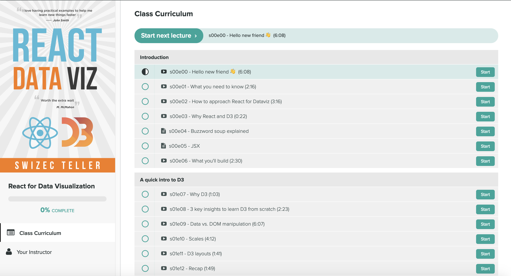

import { Box, Flex, Button } from "rebass"
import { graphql } from "gatsby"
import GumroadButton from "../components/GumroadButton"
import TweetEmbed from 'react-tweet-embed'
import { LazyImage, LinkImage } from '../components/Image'
import {
  Banner, NavGrid, Container, Grid, Title, JumpToCourse, Testimonial,
  EmailSignup,
  CopyBlock,
  AboutMeFeatures,
  FeatureList,
  TableOfContents,
  Pricing,
  Examples,
} from '../components/Blocks/index'
import Avatar from "../components/avatar"
import { Video } from "../components/Video"
import pshot2 from '../images/pshot2.gif'

export const pageQuery = graphql`
  query {
    Test2: file(relativePath: { eq: "Test2.jpg" }) {
      childImageSharp {
        fluid(maxWidth: 300, maxHeight: 300) {
          ...GatsbyImageSharpFluid
        }
      }
    }
    Test3: file(relativePath: { eq: "Test3.jpg" }) {
      childImageSharp {
        fluid(maxWidth: 300, maxHeight: 300) {
          ...GatsbyImageSharpFluid
        }
      }
    }
    Test6: file(relativePath: { eq: "Test6.jpg" }) {
      childImageSharp {
        fluid(maxWidth: 300, maxHeight: 300) {
          ...GatsbyImageSharpFluid
        }
      }
    }
    PerWiklander: file(relativePath: { eq: "perwiklander.jpeg" }) {
      childImageSharp {
        fluid(maxWidth: 300, maxHeight: 300) {
          ...GatsbyImageSharpFluid
        }
      }
    }
    Test5: file(relativePath: { eq: "Test5.png" }) {
      childImageSharp {
        fluid(maxWidth: 300, maxHeight: 300) {
          ...GatsbyImageSharpFluid
        }
      }
    }
    Test8: file(relativePath: { eq: "Test8.png" }) {
      childImageSharp {
        fluid(maxWidth: 300, maxHeight: 300) {
          ...GatsbyImageSharpFluid
        }
      }
    }
    swizec: file(relativePath: { eq: "me-circle.png" }) {
      childImageSharp {
        fluid(maxWidth: 350, quality: 100) {
          ...GatsbyImageSharpFluid
          presentationWidth
        }
      }
    }
  }
`

<Title h1># Stop copy pasting D3 examples,  
  create data visualizations of your own</Title>

<Container width={[1, 1, 1 / 2]} mt={[-0.5, -1, -1]} mb={[4, 4, 5]} sx={{textAlign: 'center'}}>

Learn how to **build scalable dataviz components** your whole team can understand with React for Data Visualization.

<Video id="CoTTJ-vR1Mc" />

So you want to build a beautiful data viz. You've got data burning a hole through your pocket, an idea for a juicy story, and your boss or client are waiting for results.

You want something that looks great, works in the browser, performs on mobile, lets users interact with their data, syncs across an entire dashboard, and works as building blocks for future projects.

Cool ... now what?

I remember building my first data visualization back in 2012. Visualized my coding habits from GitHub data.

</Container>
<Container width={[1, 3/4, 3 / 4]}>


</Container>

<Container width={[1, 3/4, 1 / 2]}>

I was so proud! Only took me a week. <span role="img" aria-label="strong arm">💪</span>

</Container>

<Title h2>
## &quot;I've tried D3 in the past, found it powerful but a bit confusing to use&quot;
</Title>
<Container width={[1, 3/4, 1 / 2]}>

Dynamic data visualization for the web is a pain in the ass you see.
Harder than it looks.

Yeah sure anyone can build a chart in google docs but that's not what you're after is it? You can't build a product on top of google sheets. You definitely can't feed in dynamic data from an API, personalized to the user, and let them navigate and explore.

You've heard people build these amazing things with D3. The New York Times uses it, The Guardian does, so do Netflix, Uber, 23andMe, Visa, Walmart, and many others. I know because they've been to my workshops ;)

You hunt the web for examples and omaigod what is this!? How the hell is D3 doing that? <span role="img" aria-label="oO">😳</span>😳


That's a bar chart by the way. You'd never guess just looking at the code. I've been doing this for years and I still have to simulate D3 examples in my mind to figure out how they work.

You decide that's too much and look for a library. Something easy you can use to finish real quick.

You find a bunch of libraries built on top of D3. Some even combine React and D3. Perfect for any modern web project!

You cobble something together and call it a day. Job well done.

<LazyImage
  src="https://media.giphy.com/media/woZVO2B8ZQ55DqKsmN/giphy.gif"
  height={260}
/>

<JumpToCourse to="#pricing" style={{ marginTop: '15px' }}/>

</Container>

<EmailSignup />

<Title h2>
## Libraries are hard to customize
</Title>
<Container width={[1, 3/4, 1 / 2]}>

Your boss takes one look and says _"Ok but can you make it follow our style guide?"_

Errr ...

Okay okay, some CSS, a little trickery, tweak the arguments and you got dis. Crisis averted!

_"I don't like how this animation looks"_

_"Can we tweak that margin?"_

_"Make those bars taller"_

_"Add a line chart and I want tooltips to show up on all 5 charts when I mouse over the same data point"_

Now you're in trouble buster.

<LazyImage
  src="https://media.giphy.com/media/IYIlvuWc21U4g/giphy.gif"
  height={260}
/>

You used a library and those always break down when you start customizing stuff. At some point you spend more time fighting the library than building your data visualization.

Time to learn D3.

</Container>

<Title h2>
## &quot;There are way too many shitty resources on D3 floating around on the interwebs, and frankly, the D3 docs are shit too because they're WAY TOO COMPLICATED AND VERBOSE for someone that just wants to understand how it works and get shit done.&quot;
</Title>
<Container width={[1, 3/4, 1 / 2]}>

You can do what everyone else does: Copy paste some examples that look like what you're building, make some tweaks, and hope for the best.

You're not proud of your code and you're not quite sure how it works, but it works and that's what matters. Right?

Yep that works until you have to change something. Or explain how it works to another engineer on your team so they can fix a bug.

God forbid you come back 6 months later looking to fix a thing or add a feature. Time to re-study all of that code and figure out how it works.

ugh

<Testimonial
  quote="I'm starting a new position where I will focus on data visualization using React and d3. I got everything I needed from the book, your examples were straight forward and easy to follow. Thanks!"
  image={props.data.Test3.childImageSharp.fluid.src}
  name="Aristides Staffieri"
  company="Engineer at ProtectWise"
/>

</Container>

<CopyBlock />

<Title h2>
## &quot;without it I'm stuck using stack overflow in a disjointed, incorrect mess&quot;
</Title>

<Container width={[1, 3/4, 1 / 2]}>

<LazyImage height={300} src={pshot2} />

You can avoid all that and learn how to build scalable and reusable dataviz components your whole team and future you can understand with React for Data Visualization.

Get the confidence you need to excel and build anything you can imagine. 💪

React is the biggest revolution in JavaScript programming since jQuery hit the scene 10 years ago, and D3 is unlike anything you've seen before.

The problem comes from how most of us first learn to code. "It's like a cooking recipe", teachers will say.

Take a bell pepper and cut it up. Then sprinkle some salt and pepper, add olive oil, and voila: you have a refreshing salad. A very simple salad with a single ingredient, but a salad nonetheless. You can follow along and eventually you will understand what the code does.

That's imperative programming. It reads as a series of steps. How to do something.

React and D3 are declarative. You don't write How you want your code to work, you write What you want to achieve. Your bell pepper salad recipe looks more like this:

```jsx
  <Salad>
  <Oil />
  <BellPepper cut salted />
</Salad>
```

You look at that and you know it's a salad. It involves oil and bell peppers. You don't have to read the steps to know the result. The recipe declares what it's making.

Declarative code makes your project cleaner and easier to maintain. Means more time creating value for your users and clients.

But learning how to think declaratively is hard. It starts like voodoo magic. We've all been there. It still hurts my brain sometimes.

That's why **React for Data Visualization** starts with small building blocks then builds up to entire dashboards. Learn the basics in about an hour, then dive as deep as you want

<JumpToCourse to="#pricing" style={{ marginTop: '15px', margintBottom: '15px' }}/>

<Testimonial
  quote="I use React because it is the sane way of doing things. I use D3 because I have to. I want nice interactive charts. I want to stay sane."
  image={props.data.PerWiklander.childImageSharp.fluid.src}
  name="Per"
  company="Frontend Consultant"
/>

</Container>
<Title h2>
## Why use React and D3 for data visualization
</Title>
<Container width={[1, 3/4, 1 / 2]}>

I believe React combined with D3 is the best thing that's ever happened to data visualization on the web.

React's approach to components makes your code more reusable, its advanced algorithms make it fast, and D3 has the best tools for dataviz. Together they represent two of the most popular JavaScript libraries on the web.

Watch some of my conference talks for a sneak peek 👇

<Video id="UP1nCXG2t4M" />

The talk shows a proof of concept approach to making fancy animations with React and d3js - a Space Invaders game. I explain the basic approach, where I got the idea, and show off some code.

<Video id="47uMw-2mb4U" />

This talk is more hands on. I show how the animated alphabet, particle generator, and talk about the benefits of componentization when it comes to building modern data visualization.

<Video id="9JvIyz7uB2s" />

You don't have to watch the whole talk, it's all in React for Data Visualization.

<Video id="Bdeu-BFisJU" />

A Learn with Jason episode where in just an hour we built an animated scatterplot from scratch and proved React-based D3 visualization works great with Gatsby. The dataviz rendered statically at build time.

</Container>
<Title h2>
## React for Data Visualization is designed for busy people like you
</Title>
<Container width={[1, 3/4, 1 / 2]}>



React for Data Visualization gives you a **quick overview of the basics** to get you started, followed by a **deep dive** that **solidifies your knowledge** through varied projects and examples. **Build working code** that you can **show off to your friends, boss, and coworkers.**

Learn the basics with **interactive examples right in your browser** — no need to install anything. Forget about Npm and Webpack and Babel and Node. **Just React and D3.**

**Dive into complex projects** that teach you how it all fits together. Build **interactive visualizations**, create **animations**, and build **fast performance with canvas**. Learn everything there is to know about building **beautiful apps with React and D3.**

From the very **basics of React and D3**, to state handling with **Redux** and **MobX**, React alternatives like **Preact** and **Inferno.**

And the best part?

It's all cut into bite sized pieces. Whether you've got 5 minutes or an hour, you can get through this course. That's a promise.

</Container>
<Title h2>
## Start with the building blocks
</Title>

<FeatureList />
<Container width={[1, 3/4, 1 / 2]}>

<Testimonial
  quote="The examples in V4 are off the hook. No wonder its been so much work, you have really extended the learning process into fun, interactive projects. I was specifically trying to learn topojson an map visualizations! What a breeze!"
  image={props.data.Test5.childImageSharp.fluid.src}
  name="Julio Gudiño"
  company="Frontend Developer"
/>

</Container>
<Title h2>
## React for Data Visualization builds on practical examples
</Title>
<Container width={[1, 3/4, 1 / 2]}>

<Examples />

<JumpToCourse to="#pricing" style={{ marginTop: '15px' }}/>

<TableOfContents />

</Container>

<Pricing />

<EmailSignup />
<Container width={[1, 3/4, 1 / 2]}>


<Testimonial
  quote="I love having practical examples to help me learn new things faster. D3's docs alone are okay but marrying them with React (as a react newbie) is not as straightforward as someone handholding you through the process. And, since I don't have hours after work or on weekends to hack on things like I used to before I was married (or had kids), I need to optimize my learning."
  image={props.data.Test6.childImageSharp.fluid.src}
  name="Paulo Elias"
  company="Self Taught Developer"
/>

</Container>
<Title h2>
## About the Author
</Title>
<Container width={[1, 3/4, 1 / 2]}>

<LinkImage link="https://swizec.com" image={props.data.swizec.childImageSharp} />

Hi, I’m **Swizec Teller**. I help **coders become software engineers.**

Story time 👇

React+D3 started as a bet in April 2015. A friend wanted to learn React and challenged me to publish a book. A month later React+D3 launched with 79 pages of hard earned knowledge.

In April 2016 it became **React+D3** ES6. 117 pages and growing beyond a single big project it was a huge success. I kept going, started live streaming, and publishing videos on YouTube.

In 2017, after 10 months of work, **React + D3v4** became the best book I'd ever written. At 249 pages, many examples, and code to play with it was designed like a step-by-step course. But I felt something was missing.

So in late 2018 I rebuilt the entire thing as  — a proper video course. Designed for busy people with real lives like you. Over 8 hours of video material, split into chunks no longer than 5 minutes, a bunch of new chapters, and techniques I discovered along the way.

**React for Data Visualization** is the best way to learn how to build scalable dataviz components your whole team can understand.

Some of my work has been featured in 👇

<AboutMeFeatures />

</Container>

<CopyBlock />

<Container width={[1, 3/4, 1 / 2]}>

<Testimonial
  quote="A sharply written work that delivers technical information in a conversational and easy to digest manner."
  image={props.data.Test8.childImageSharp.fluid.src}
  name="Malcolm Maclean"
  company="Author of D3 Tips & Tricks"
/>

</Container>

<Pricing />

<Title h2>
## FAQ
</Title>
<Container width={[1, 3/4, 1 / 2]}>

**IS REACT FOR DATA VISUALIZATION FOR ME?**

<TweetEmbed id="1095042940513050624" />

**WHICH PACKAGE SHOULD I CHOOSE?**

coming soon

**I DON'T LIKE REACT. IS REACT FOR DATA VISUALIZATION STILL USEFUL?**

Yes! You can apply the core ideas behind React for Data Visualization to any modern framework. Angular, Vue, or anything else that aims to separate business and rendering logic with a declarative approach.

**WHAT IF I HATE YOUR COURSE?**

Send me an email and I'll click the magic refund button. You even get to keep the downloadable resources.

**How does this compare to React + D3v4?**

A lot of the underlying principles are still the same. I've updated a lot of the code itself so it fits modern React and D3 versions. There's a whole new chapter on React Hooks. Also a chapter on existing React+D3 libraries to help you decide if you'd prefer using a library instead of rolling your own.

I also discovered a new hybrid approach to transitions/animation that I'm adding a chapter for this week. And I plan to add a chapter on React Native and WebGL. There's also a new section with 14 cookbook-like projects you can explore.

Oh and most everything comes with video now. About 9 hours of video content for the core content and another 10 or so for the cookbook projects.

<Testimonial
  quote="Great read with solid foundations to get you started crawling with react and up to a sprint!"
  image={props.data.Test2.childImageSharp.fluid.src}
  name="MΛHDI"
  company="Creator of Gyroscope"
/>

</Container>
